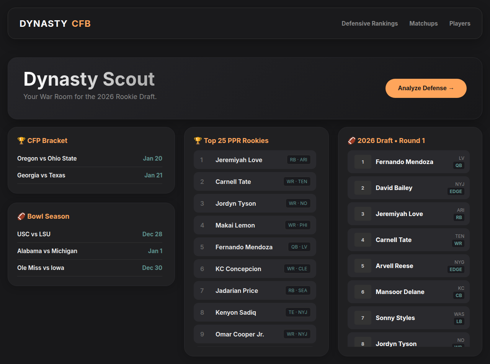

# Dynasty Scout

College football dynasty scouting: live defensive rankings, matchup intel, and a searchable 2026 rookie draft board.

**Live demo:** [https://cfbanalyzer.xyz](https://cfbanalyzer.xyz)



[](https://github.com/SaiG-esp/Dynasty-Football/actions/workflows/ci.yml)
[](LICENSE)

## What it does

Dynasty Scout is a war-room dashboard for dynasty fantasy football. It combines a React scouting UI with a Python data engine that pulls CollegeFootballData (CFBD) stats so you can:

- Rank FBS defenses by a custom **havoc** formula (TFL, sacks, takeaways, pass breakups)
- Browse a **searchable player database** of the 2026 class with per-player profiles
- Load **red-zone usage and betting context** on a player without exposing API keys in the browser
- Inspect a **playoff / matchup** view alongside the draft board

## System architecture

```
Browser (React + Vite SPA)
        │  same-origin /api
        ▼
┌─────────────────────────────────────────────────────────┐
│  Local: FastAPI (data-engine/main.py) + PostgreSQL      │
│  Production: Vercel serverless functions (frontend/api) │
└─────────────────────────────────────────────────────────┘
        │
        ▼
CollegeFootballData API (server-side CFBD_API_KEY only)
```

| Layer | Choice | Why |
|---|---|---|
| **Frontend** | React 19 + Vite | Fast SPA with HMR; static player JSON ships with the bundle |
| **Backend (local)** | FastAPI + Uvicorn | Thin JSON API over Postgres and CFBD |
| **Backend (prod)** | Vercel Python serverless | Same `/api/defenses` and `/api/players/advanced` contracts without hosting Postgres |
| **Database** | PostgreSQL (`defensive_intel`) | Local cache of FBS havoc ratings loaded by `matchup_data3.py` |
| **External data** | [CollegeFootballData](https://collegefootballdata.com/) | Official FBS stats, PBP, and betting lines |

The browser never talks to CFBD and never holds an API key. `frontend/src/prospects.json` is the one generated data file checked in; other script outputs stay local.

```
data-engine/fetch_directory.py  ─┐
data-engine/fetch_details.py    ─┴─► frontend/src/prospects.json ─► Players / Player Profile
data-engine/matchup_data3.py    ────► PostgreSQL ─► GET /defenses ─► Defensive Rankings (local)
CollegeFootballData (server-side) ─► GET /players/advanced ─► Player Profile advanced stats
```

If `/defenses` is unreachable, rankings still render every team with `-` for missing stats.

## Technical highlights

- **Server-only CFBD proxy.** Advanced stats (red-zone usage + betting context) are computed on FastAPI / Vercel Python functions. The SPA only calls same-origin `/api`; Vite proxies that to `:8000` in development.
- **Name-safe live merge.** `mergeDefenseStats.js` joins CFBD team names onto static conference metadata (including abbreviation aliases like `S. Carolina` → `South Carolina`) and degrades cleanly when a row is missing.
- **Custom havoc formula.** Shared `defense_intel.py` scores every FBS defense as `(TFL + 2·INT + 2·FUM + 1.5·sacks + PD) / games` and bulk-loads the table that powers rankings.

## Local setup

Requires **Node 20+**, **Python 3.11+**, and **PostgreSQL**.

```bash
git clone https://github.com/SaiG-esp/Dynasty-Football.git
cd Dynasty-Football
```

### 1. Database

```bash
createdb postgres    # skip if it already exists
psql -d postgres -f data-engine/defensive_intel.sql
```

### 2. Data engine / API

```bash
cd data-engine
python3 -m venv venv
source venv/bin/activate
pip install -r requirements.txt
cp .env.example .env    # add CFBD_API_KEY + DB credentials
```

Get a free CFBD key at https://collegefootballdata.com/key. Then optionally refresh data and start the API:

```bash
python3 fetch_directory.py    # builds frontend/src/prospects.json
python3 fetch_details.py      # enriches it with game logs
python3 matchup_data3.py      # populates defensive_intel in Postgres
uvicorn main:app --reload --port 8000
```

`GET /defenses` only needs Postgres. `GET /players/advanced` needs `CFBD_API_KEY`. Re-run `matchup_data3.py` periodically during the season to refresh rankings.

### 3. Frontend

```bash
cd frontend
npm install
cp .env.example .env   # usually leave VITE_API_BASE_URL unset
npm run dev
```

Open http://localhost:5173. By default the app calls **same-origin `/api`**:

- **Local:** Vite proxies `/api` → `http://localhost:8000`
- **Production (Vercel):** serverless functions under `frontend/api/` (project Root Directory is `frontend`)

Only set `VITE_API_BASE_URL` if FastAPI is hosted elsewhere. **Do not** put a CFBD key in any `VITE_*` variable — those are baked into the browser bundle.

### Tests

```bash
cd frontend && npm test && npm run lint
cd data-engine && python3 -m unittest test_advanced_stats.py
```

## Environment variables

Templates with placeholders live in:

- [`data-engine/.env.example`](data-engine/.env.example) — `CFBD_API_KEY`, Postgres, CORS
- [`frontend/.env.example`](frontend/.env.example) — optional `VITE_API_BASE_URL`

For production, set `CFBD_API_KEY` as a Vercel project env var (Production). Confirm with `https://cfbanalyzer.xyz/api/health` (`cfbd.configured` should be `true`).

## Data-engine CLI tools

Standalone research scripts (not required to run the UI). Each prints a report and can save a CSV:

| Script | What it reports |
|---|---|
| `player_game_log.py` | Per-game box score + explosive-play counts |
| `redzone_report.py` | Team red-zone trips (PBP vs official) + player RZ touches |
| `betting_report.py` | Spread, over/under, implied points, 1–10 difficulty vs team average |
| `usage_report.py` | Touch share and game-script-neutral usage |
| `scout_3rd_down.py` | 3rd-down passing conversion, player vs team |
| `matchup_data.py` | Schedule difficulty: spread + opponent havoc |
| `matchup_data3.py` | Bulk-load FBS havoc into Postgres for `/defenses` |
| `defense_intel.py` | Shared havoc-formula module |
| `run_or_pass.py` | Weekly run/pass tendency by down and distance |
| `get_pbp_api.py` | Raw play-by-play fetch helper |

## GitHub About box (maintainers)

GitHub's sidebar cannot be set from this repo file. In **Settings → General**:

- **Description:** College football dynasty scouting dashboard that turns live CFBD stats into defensive rankings, matchup intel, and a searchable 2026 rookie draft board.
- **Website:** https://cfbanalyzer.xyz
- **Topics:** `react` `vite` `fastapi` `postgresql` `python` `javascript`

## License

MIT. See [LICENSE](LICENSE).

## Notes

- API keys that were previously committed in git history should be treated as compromised and rotated at collegefootballdata.com.
- `venv/`, CSV dumps, and Python caches are git-ignored — do not commit them.
